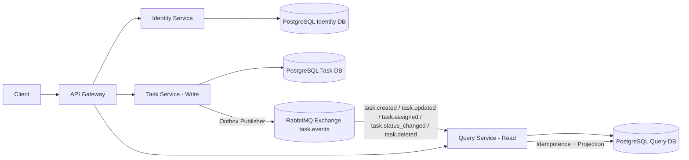
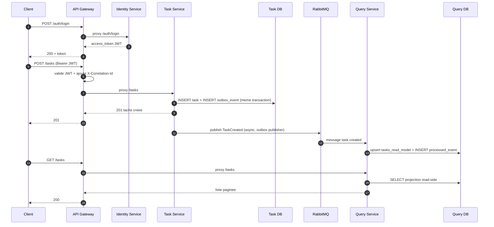

# GEOF Task Management
## 1. Objectif du projet

Le projet implemente un backend de gestion de taches en microservices.
Le systeme couvre:

- authentification JWT
- autorisation RBAC (roles + permissions)
- gestion complete du cycle de vie des taches
- separation write/read avec CQRS
- propagation asynchrone des changements via RabbitMQ
- exposition unifiee via un API Gateway

L'objectif principal est d'avoir une architecture claire, scalable, et robuste.

## 2. Architecture globale

Le projet est compose de 4 services applicatifs:

- `api-gateway`: point d'entree unique
- `identity-service`: auth + utilisateurs + roles + permissions
- `task-service`: write-side (creation/modification/suppression des taches)
- `query-service`: read-side (liste filtree + analytics)

Infrastructure associee:

- 3 bases PostgreSQL (une par service metier)
- 1 broker RabbitMQ
- Docker Compose pour l'orchestration locale

Chaque service possede son schema de donnees et ses migrations Alembic.

## 3. Diagramme d'architecture

## 4. Techniques et patterns utilises

## 4.1 Microservices

- services independants, chacun responsable de son domaine
- pas d'acces direct a la base d'un autre service
- communication synchrone via HTTP et asynchrone via events

## 4.2 API Gateway

Le gateway centralise:

- routage vers le bon service
- validation JWT (signature + `iss` + `aud` + expiration)
- ajout/propagation du `X-Correlation-Id`
- rate limiting in-memory par client
- normalisation des erreurs proxy (ex: `502` si upstream indisponible)

Routage principal:

- `/auth/*`, `/roles`, `/permissions` -> `identity-service`
- `GET /tasks` -> `query-service` (lecture)
- `POST/PUT/DELETE/... /tasks*` -> `task-service` (ecriture)
- `/analytics/*` -> `query-service`

## 4.3 Securite (JWT + RBAC)

Authentification:

- login via `identity-service`
- generation d'un JWT (algo actuel: `HS256`)
- claims principales: `sub`, `email`, `roles`, `scopes`, `iat`, `exp`, `iss`, `aud`

Autorisation:

- `task-service` et `query-service` verifient les scopes via `require_scopes(...)`
- exemples: `task:create`, `task:read`, `task:update`, `task:delete`, `task:assign`, `analytics:read`

RBAC:

- tables `users`, `roles`, `permissions`, `user_roles`, `role_permissions`
- bootstrap automatique des roles/permissions par defaut (`admin`, `member`)

## 4.4 CQRS

`task-service` est la source de verite (write model).
`query-service` maintient une projection denormalisee (read model).

Avantage:

- lecture rapide pour listing/analytics
- ecriture isolee des contraintes de presentation

## 4.5 Fiabilite des events

Pattern Outbox dans `task-service`:

- l'operation metier et l'evenement sont persistes dans la meme transaction DB
- un publisher asynchrone lit `outbox_events` et publie dans RabbitMQ
- retries avec backoff
- statut des events: `pending`, `published`, `failed`

Cote `query-service`:

- consumer RabbitMQ en thread dedie
- idempotence via table `processed_events` (cle `event_id`)
- retries de message via header `x-retry-count`
- si echec repete, message envoye en DLQ (`query.tasks.dlq`)

## 5. Endpoints metier implementes

Identity:

- `POST /auth/register`
- `POST /auth/login`
- `GET /auth/me`
- `GET /roles`
- `GET /permissions`

Task (write):

- `POST /tasks`
- `GET /tasks`
- `GET /tasks/{id}`
- `PUT /tasks/{id}`
- `POST /tasks/{id}/assign`
- `POST /tasks/{id}/status`
- `DELETE /tasks/{id}`

Query (read):

- `GET /tasks?page=&page_size=&status=&priority=&assignee=`
- `GET /analytics/overview`

Tous les services exposent aussi:

- `GET /`
- `GET /health/live`
- `GET /health/ready`

## 6. Diagramme d'enchainement principal (login -> create task -> projection -> read)

## 7. Organisation du code (structure commune par service)

Sous `app/`:

- `core/`: config, DB, securite, logging, dependances
- `models/`: modeles SQLAlchemy
- `routers/`: endpoints FastAPI
- `schemas/`: modeles Pydantic
- `main.py`: creation de l'app + lifespan

Cette structure est la meme sur les services, ce qui simplifie la maintenance.

## 8. Observabilite et exploitation

- Correlation ID de bout en bout via header `X-Correlation-Id`
- healthchecks live/ready sur chaque service
- logs standardises
- migration DB executee au demarrage container:
  - `alembic -c alembic.ini upgrade head`
